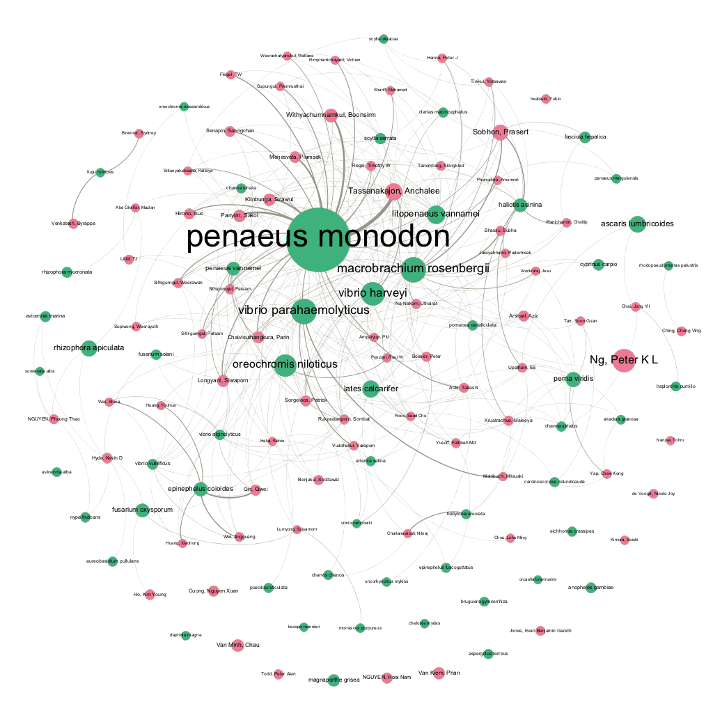

# The Scientific Landscape {#scientific}

In this section we examine the scientific landscape for research involving marine species. In total we identified 6,659 scientific publications in Clarivate Analytics Web of Science Core Collection that contained a marine species listed in the World Register of Marine Species (WoRMS) database. Approximately 17,736 researchers were engaged in research on marine species and ASEAN researchers were co-authors on 77% (5,109) of the publications. The 6,659 records contained 3,685 marine species after the exclusion of common model organisms.

Figure \@ref(fig:marineres) displays a snapshot overview of activity for marine species in the region.

```{r marineres, echo=FALSE, fig.align='center', echo=FALSE, out.width='100%', fig.cap="Overview of Research Activity for Marine Species in ASEAN countries"}
knitr::include_graphics("images/aseanmarinlit_overview.png")
```

In Figure \@ref(fig:marineres) we can immediately see that marine research in the ASEAN region encompasses countries within and outside the region. This reflects the increasingly international nature of modern scientific research and marine research. We can also observe significant variation in levels of marine publications between ASEAN countries with respect to trends that reflect the underlying emphasis and strength of each country with respect to marine research. Finally, information on the subject area of research reveals the prominence of Marine & Freshwater Biology (as we would expect) along with more applied fields such as Biotechnology & Applied Microbiology and Parasitology or Immunology that provide an indication of potentially more commercially oriented research areas.^[Subject Areas refer to Web of Science Subject Categories which seek to describe the subject area of journals where articles are published. A single journal may fall into more than one category and are used here as a proxy for summarising research subjects]  

### Trends by Country

The presentation of trends by country in Figure \@ref(fig:marineres) has the effect of pressing countries with lower level marine research outputs to the bottom of the graph. We gain a clearer view of country level trends in Figure \@ref(fig:marinetrends) where the data for each country is presented in separate panels. In Figure \@ref(fig:marinetrends) we present the data as a scatterplot and then add a smoothed trend line (using Loess or locally weighted smoothing) between the data points.

```{r load_wos, echo=FALSE, eval=TRUE}
load("data/wos_asean_marine_6659.rda")
```

```{r workings, eval=FALSE, echo=FALSE}
library(tidyverse)
# select required columns
aseanmarine_trends <- wos_asean_marine_6659 %>% 
  select(key, isi_unique_article_identifier_countryid, publication_year) %>% 
  separate_rows(., "isi_unique_article_identifier_countryid", sep = ";")
aseanmarine_trends$isi_unique_article_identifier_countryid <- stringr::str_trim(aseanmarine_trends$isi_unique_article_identifier_countryid, side = "both") 
# trim white space after separate or will not count correctly due to leading white space

# count
aseanmarine_trends <- aseanmarine_trends %>% 
  count(isi_unique_article_identifier_countryid, publication_year)

# visualize
aseanmarine_trends %>% 
  filter(., publication_year >= 2000 & publication_year <= 2016) %>%
  plotly::plot_ly(., x = ~publication_year, y = ~n) %>%
  plotly::add_lines(split = ~isi_unique_article_identifier_countryid)
```

```{r ggplottrends, eval=FALSE, fig.align='center', echo=FALSE, out.width='100%', fig.cap="Country Trends for Research on Marine Genetic Resources in the South East Asia Region", message=FALSE}
library(ggplot2)
aseanmarine_country_trends <- aseanmarine_trends %>% filter(., publication_year >= 2000 & publication_year < 2016) %>%
  ggplot(., aes(x = publication_year, y = n, group = isi_unique_article_identifier_countryid)) +
  geom_point(aes(color = isi_unique_article_identifier_countryid)) + 
  stat_smooth(se = FALSE) +
  facet_wrap(~isi_unique_article_identifier_countryid, shrink = FALSE, scales = "free_y") + 
  theme_minimal() +
  theme(legend.position = "none") +
  scale_x_discrete(breaks = c("1990", "2015")) +
  xlab("Marine Publications") +
  ylab("Publication Year")
#plotly::ggplotly(aseanmarine_country_trends) # needs to be subplot annoyingly
aseanmarine_country_trends
```

```{r echo=FALSE, eval=FALSE}
save(aseanmarine_trends, file = "data/aseanmarine_trends.rda")
```

```{r load_trends, echo=FALSE}
load("data/aseanmarine_trends.rda")
```

```{r marinetrendsworkings, eval=FALSE, echo=FALSE, message=FALSE}
library(geofacet)
library(ggplot2)
library(tidyverse)
#sea_grid1 <- sea_grid1[-10,] # drop east timor or shows as blank. Run only once or will delete successively. 
aseanmarine_country_trends <- aseanmarine_trends %>%
  filter(., publication_year >= 2000 & publication_year < 2016) %>%
  ggplot(., aes(x = publication_year, y = n, group = name)) +
  geom_point(aes(color = name), show.legend = FALSE) + 
  stat_smooth(se = FALSE) +
  facet_geo(~name, grid = "sea_grid1", label = "name", shrink = FALSE, scales = "free_y") +
  xlab("Marine Publications") +
  ylab("Publication Year")
aseanmarine_country_trends
```

```{r marinetrends, echo=FALSE, fig.align='center', echo=FALSE, out.width='100%', fig.cap="Country Trends for Research on Marine Genetic Resources in the South East Asia Region"}
knitr::include_graphics("images/country_trends.png")
```

This reveals, that in general all countries within the region have displayed an increase in publications on marine research over time with Myanmar, Laos, Cambodia and Brunei exhibiting less than 10 publications per year across all years. For countries with higher levels of activity, Thailand emerges as the leading country for research involving marine species. However, research outputs plateaued from 2010 onwards before staging a more recent increase in 2016. In the meantime, as can more clearly be seen in Figure \@ref(fig:marinetrends), Malaysia has displayed a steeply rising trend in research outputs that has overtaken Thailand. In contrast with countries throughout the region that display a rising trend, the Philippines displays a declining trend from approximately 2008 onwards that may reflect either a change in the orientation or research outputs (for example with a more applied focus that place less emphasis on publications) or a decline in research investment in marine research. 

Research outputs, in the form of peer reviewed research articles and scientific publications, reflect underlying investments and incentives for scientific research in the marine and terrestrial aquatic environments. As we have seen, while varying in intensity, in the majority of ASEAN countries marine organisms are an increasing or emerging focus of scientific publications. We now take a closer look at the nature of research activity. 

### Marine Species Research

Figure \@ref(fig:taxonomysubjectarea) presents an overview of marine research in the ASEAN region from the perspective of the species that are a focus of research. For the top ten species we provide a set of short fact sheets in Chapter \@ref(species) of the report. Here we present a short summary for the top species. 

```{r taxonomysubjectarea, echo=FALSE, fig.align='center', echo=FALSE, out.width='100%', fig.cap="Top Marine Species Overview"}
knitr::include_graphics("images/aseanmarinlit_species_overview.png")
```

In considering Figure \@ref(fig:taxonomysubjectarea) a number of the top species are shrimps associated with the rapid growth of aquaculture in the region from the late 1990s onwards [@Hishamunda_2009].

Figure \@ref(fig:taxonomysubjectarea) reveals that the species that the Giant Tiger Shrimp (*Peneaus Mondon*) is a major focus of research activity that reflects the economic importance of the species in the aquaculture sector within the ASEAN region. Research with respect to *Peneaus Mondon* is directed towards maximizing yields. A significant proportion of the literature focuses on understanding *P. mondon* immune responses to viral and bacterial pathogens that are responsible for large scale mortality in tiger shrimps, notably White Spot Syndrome Virus, Yellow Head Virus and *Vibrio harveyi* [@Wongteerasupaya_1995; @Ponprateep_2011; @Jaree_2012]. 

The second ranking animal species in the data also relates to aquaculture. *Macrobrachium rosenbergii* (the Giant River Prawn and the Giant Freshwater Prawn) is widely fished and is the main freshwater shrimp cultivated within the commercial aquaculture industry [@Macrobrachium_2012].^[Source: IUCN Red List at [http://www.iucnredlist.org/details/197873/0](http://www.iucnredlist.org/details/197873/0)] While this is a freshwater species, females move into brackish estuarine waters to lay their eggs. As with *P. mondon* research is directed towards maximizing yields and reducing mortality from pathogens such as White Tail Disease virus [@Bonami_2011]. Improvements to broodstock genetics [@Karaket_2012; @Nguyen_Thanh_2015; @Thanh_2010] as well as improvements to prawn feed [@Kangpanich_2016] have been a significant focus of research activity. 

*Oreochromis niloticus* is a species of Tilapia, a cichlid fish native to the Nile basin in Africa and coastal rivers of Israel.^[Source: Encyclopaedia of Life at [http://eol.org/pages/356343/data?toc_id=4#1448](http://eol.org/pages/356343/data?toc_id=4#1448)] It is an economically important species introduced into the ASEAN region and elsewhere because it is fast growing. The literature focuses on issues such as genetic improvement [@Bentsen_1998], options for rice paddy field polyculture in conjunction with other species [@Vromant_2002] , and salt tolerant hybrids for aquaculture in coastal ponds for this freshwater species [@Kamal_2005].

*Litopenaeus vannamei* is the world's dominant cultivated shrimp. It grows as a juvenile in estuarine environments and lives in marine salt water as an adult. South East Asia has witnessed dramatic growth in aquaculture for this species, notably in Thailand and China. Improving breeding stocks [@Nimrat_2006], protection against infectious myonecrosis [@Silva_2010], and alternatives to the use of antibiotics such as the use of probiotics [@Nimrat_2011] feature prominently in the literature for this major species. 

*Lates calcarifer* is the Barramundi or Asian seabass and is a widely distributed demersal fish ranging from the Persian Gulf through South East Asia and Papua New Guinea.^[Demersal fish are bottom feeders in what is known as the demersal zone] It is typically found in estuaries, coastal waters, lagoons and rivers. Research has focused on aquaculture for this species including understanding the natural history of the species [@Shadrin_2015] and fish feed [@Shansudin_1997; @Mohd_Yusof_2010] including the use of local seaweed species [@Shapawi_2015].

*Ascaris lumbricoides* is the large roundworm and is responsible for causing ascariasis in humans. While *A. lumbricoides* is aquatic and recorded by WoRMS as a marine species it is excluded from further analysis because the focus of the scientific literature in the ASEAN region is on soil transmitted helminth infections in humans, including in coastal areas, rather than the marine environment as such [@Montresor_2007].

*Perna viridis* is commonly known as the Indian Green Mussel. Research in relation to this species in ASEAN countries focuses on issues such as the impacts of metal concentrations, notably heavy metals on speciation, the implications of contamination for human health and the potential use of the species for wider biomonitoring of heavy metal contamination [@Yap_2002; @Yap_2004; @Yap_2003]. Other research addresses concentrations of shellfish toxins and *Vibrio parahaemolyticus* in *P. viridis* [@Marasigan_2001] along with issues such as suspension feeding behaviour [@Hawkins_1998; @Tan_2016] and genetic diversity [@Ye_2015]. As this suggests, land based run offs of contaminants into the marine environment in the ASEAN region has become a significant focus of research for this economically important species. 

*Epinephelus coioides* is the Orange Spotted Grouper or Estuary Cod. This is an IUCN Red List near threatened species that in its juvenile stage is found in estuaries and mangroves and as adults in brackish water and coastal reefs. ^[Source: Fishbase [http://www.fishbase.org/summary/6465](http://www.fishbase.org/summary/6465)] It is a commercially important species including in aquaculture. Research in the ASEAN region has included work on cell lines [@Qin_2006], feeding performance [@Doi_1997; @Eusebio_2004] and the immune system of this important commercial species [@Zhou_2011; @Guo_2012].

Two bacteria feature prominently in marine research in the ASEAN region. The first of these is *Vibrio parahaemolyticus*, a gram negative bacteria that is found in estuarine, coastal and marine waters. *Vibrio parahaemolyticus* is now a globally distributed species associated with vibriosis through the consumption of raw shellfish or exposure to contaminated water [@Nair_2007]. Within the literature for ASEAN countries the main focus is on the impact of contamination in aquaculture, including detecting strains associated with infection[@RAHMAN_2006] and vaccines [@Hu_2011]. The risks of mortality in shellfish stocks and consequent mortality rates are combined with increasing awareness of the problem of antibiotic resistance and the quest for alternatives such as botanical extracts sourced from ASEAN countries [@Sivasothy_2013; @Nguyen_2016; @Tinh_2016].

The second major bacterial species is *Vibrio harveyi*, a Gram-negative, bioluminescent and common marine bacterium in the same genus as *V. parahaemolyticus*. It is common in the gut of many tropical marine organisms with a small number of strains being pathogenic. While the bacteria is normally benign, pathogenic sub-strains are particularly associated with impacts on shrimps such as *P. mondon*, with the ASEAN literature focusing on detection and the use of natural compounds, including from marine cyanobacteria [@Ponprateep_2009; @Maneechote_2016]

*Rhizophora apiculata* is a widespread intertidal mangrove species in the ASEAN region. The species is used for firewood and is also a focus of commercial mangrove silviculture in the region [@Rhizophora_2008]. A second important mangrove species is *Avicennia marina*, known as the grey or white mangrove that is widely distributed throughout the ASEAN region and beyond. It takes form as a shrub or tree and has a range of uses as a food source, in construction and medicine [@Avicennia_2008]. Research on this species in the ASEAN region has focused on issues such as genetic structure and variation [@ARNAUD_HAOND_2006; @Giang_2003], the impacts of aquaculture water on mangroves [@Vaiphasa_2007], biodiversity [@Zhila_2013], mangrove restoration [@Aung_2011] and new plant extract for alopecia treatment [@Jain_2015; @Jain_2014].

As this brief summary of the major species suggests, the marine data is dominated by species that are commercially important in aquaculture within the region. This comes into clearer focus if we examine the relationship between research on species grouped on the genus level and the subject areas of publications. 

Figure \@ref(fig:sankeygenussubject) presents a Sankey diagram of the flow between research on the species and Subject Areas presented in \@ref(fig:taxonomysubjectarea). A Sankey diagram is typically used to display the flow of energy, in this case investments in research on species grouped on the genus level, and the intended audiences represented by the subject areas. 

We can clearly see in Figure \@ref(fig:sankeygenussubject) that research on Penaeus (e.g. Tiger Prawn) genus primarily flows into fisheries followed by Marine and Freshwater Biology. The link between research on Penaeus and Vibrio is represented by Immunology and Veterinary Science. In contrast work on mangroves (represented by Avicennia and Rhizophora) is more concentrated in Environmental Sciences (for Avicennia) and additionally Marine and Freshwater Biology, Ecology and Plant Sciences for Rhizophora. This suggests a more basic research orientation for our mangrove species as discussed above.  

```{r sankeygenussubject, echo=FALSE, message=FALSE, warning=FALSE, fig.align='center', out.width='100%', fig.cap="Flows of Publications on Species into Subject Areas"}
library(networkD3)
library(tidyverse)
library(readxl)
# import file
species_subject <- read_excel("data/sankey_species_subject.xlsx")
# limit to genus
genus <- species_subject
genus <- genus %>% separate(source, c("genus", "taxa"), sep = " ")
genus <- genus %>% select(-taxa)

# aggregate on the genus and target to remove duplicates

genus1 <- genus %>% group_by(genus, target) %>%
  tally(value) %>% 
  arrange(desc(n)) %>% 
  rename(value = n, source = genus)

# prepare data by removing the diagonal (should not be present in this dataset)
genus_test <- genus1[1:60,] %>% 
  select(source, target, value) %>%
  reshape2::dcast(source~target)
genus_test[is.na(genus_test)] <- 0 # convert NAs to zero
rownames(genus_test) <- genus_test[,1] # source to rowname to avoid overwriting
genus_test <- genus_test %>% select(-source) # drop the source
diag(genus_test) <- 0 # now remove the diagonal
#test <- rownames_to_column(test) # add source back in

# Transform it to connection data frame with tidyr from the tidyverse:
links = genus_test %>% 
  as.data.frame() %>% 
  rownames_to_column(var="source") %>% 
  gather(key="target", value="value", -1) %>%
  filter(value != 0) # keep only values over 0

# Create a node data frame for every entity involved in the flow

nodes=data.frame(name=c(as.character(links$source), as.character(links$target)) %>% unique())

links$IDsource=match(links$source, nodes$name)-1 
links$IDtarget=match(links$target, nodes$name)-1
 
# Make the Network
sankeyNetwork(Links = links, Nodes = nodes,
                     Source = "IDsource", Target = "IDtarget",
                     Value = "value", NodeID = "name", 
                     sinksRight=FALSE, fontSize = 9, fontFamily = "Arial")
```

<!--- insert images/sankeygenussubject.jpg here for pdf build--->

Figure \@ref(fig:sankeygenussubject) provides the first indication that marine research may be directed in multiple directions, from basic taxonomic and ecological research, to commercially oriented research that focuses on enhancing productivity and addressing problems such as pathogens for commercially valuable species. 

In practice, research on species takes place in networks that can be explored on multiple levels. 

First, researchers are typically performing research on more than one species. For example, work on pathogens of *P. mondon* and other shellfish will include reference both to the source species (*P. mondon*) and the target species. 

Second, there has been a growing trend towards the internationalisation of research collaborations represented by collaborations between researchers outside their home countries and regions. This is typically supported by national research institutions, such as research councils, and home institutions administering funds on behalf of national organisations. These investments form a network of collaboration between countries that are underpinned by financial investments in research, typically by national research councils or their equivalent. 

Third, collaboration networks between researchers involve inter-institutional relationships including flows of research funding, equipment, students and post-doctoral researchers. 

Finally, there are the networks of relationships between researchers who build the wider inter-institutional network and communities of researchers working on particular marine species and particular problems. 

To gain a fuller understanding of the characteristics of research on marine genetic resources in the ASEAN region we will explore each of these networks in turn. 

### The Species Network

Figure \@ref(fig:speciesnetwork) displays the network relationships between publications involving marine species where there are more than 10 publications referencing the species. The dots represent nodes in the network and are sized based on the number of records. The lines or edges are based on the number of publications where the species appear in the same publication with thickness representing the number of shared links. The colours in this case refer to the kingdom for each organism as in Figure \@ref(fig:taxonomysubjectarea).  

```{r speciesnetwork, echo=FALSE, message=FALSE, warning=FALSE, fig.align='center', out.width='100%', fig.cap="Network of Species that are the Focus of Research"}
knitr::include_graphics("images/aseanmarinlit_species_network_plus10.png")
```

What is powerful about this form of visualisation is that we can immediately see that a strong relationship between the Vibrio pathogenic viruses and important aquaculture species, notably prawns and shrimps such as *Penaeus mondon*, *Macrobrachium rosenbergii* and *Litopenaeus vannamei* among others such as *Penaeus vannamei*. We can also see that research on plants, dominated by mangroves (in green) forms a distinctive cluster of research but also links through *Avicennia marina* and *Rhizophora apiculata* to research on *Peneaus mondon* and related species [@Hai_2005].

We can apply this same approach to a broader overview of the scientific landscape for marine research at the level of the analysis of international and regional level research collaborations to which we now turn.

### Country Networks

In total 136 countries appeared in the ASEAN data for research involving marine genetic resources (see Figure \@ref(fig:marineres) above). Collaborations between countries involved in marine research can be visualized as a network. Figure \@ref(fig:marineres) below displays the country collaboration network where there are two or more publications involving researchers from those countries. Once again the size of the nodes reflects the number of publications. 

```{r countrynetwork, echo=FALSE, message=FALSE, warning=FALSE, fig.align='center', out.width='100%', fig.cap="Country Collaboration Networks for Marine Genetic Research in the ASEAN region"}
knitr::include_graphics("images/aseanmarinlit_country_network.png")
```

In Figure \@ref(fig:countrynetwork) the country nodes are sized based on the number of records that involve a publication with an author from the country. The lines (edges) represent publications by authors from both countries with the weight of the lines indicating the number of publications. The colours denote communities of collaborating countries based on the calculation of the strength of the links between them compared with the strength of connections between all other nodes (countries) [@Blondel_2008]. This allows us to see the distinctive network connections between ASEAN countries and other countries.

Figure \@ref(fig:countrynetwork) reveals 4 main country network clusters. The largest network cluster is represented by Thailand with strong connections with Japan, the United States, Australia, the UK and China along with the Philippines. Malaysia displays weaker links with a number of these countries but is distinctive for its links with India, neighbouring Brunei, Bangladesh, Pakistan and Sri Lanka. Singapore displays a weaker but wider set of connections with other countries, while Vietnam forms part of a network with South Korea, Denmark, Norway, Laos and Cambodia. The importance of mapping these collaboration networks is that they reflect underlying financial investments in the form of research funding, investments in student training, equipment and materials. 

### The Funding Network

This network of relationships between countries reflects underlying national investments in the driving force behind all research: research funding. Data on research funding is difficult to access and has only been available in *Web of Science* from 2008 onwards and suffers from a lack of uniformity in the data requiring extensive cleaning. However, we can gain a partial insight into the major funding agencies involved in marine genetic resources in the ASEAN region in the network map in Figure \@ref(fig:fundingnetwork). This network displays funding organisations that appear in the acknowledgements of more than 20 publications in the ASEAN Web of Science dataset. 

```{r fundingnetwork, echo=FALSE, message=FALSE, warning=FALSE, fig.align='center', out.width='100%', fig.cap="Major Funding Networks for Marine Genetic Research in the ASEAN region"}
knitr::include_graphics("images/aseanmarinlit_fundingnetwork.png")
```

In considering Figure \@ref(fig:fundingnetwork) we immediately observe the dominant position of the Thailand Research Fund and the Commission on Higher Education in Thailand (officially the Office of the Higher Education Commission or OHEC) along with universities in funding marine research in Thailand. While this network displays rankings based on the number of publications, rather than the size of investments, it suggests that the strong trend in publications in marine research in Thailand reflects dedicated funding investment. Looking outside Thailand, a network of external funding bodies emerges in connection with publications from Thailand in the form of the United States National Science Foundation (through the Thailand National Research Fund and the BIOTEC centre) as well as joint publications with research funding from Germany. Funding Agencies from Japan appear particularly prominently in the funding network notably through the Ministry of Education, Culture, Sports, Science and Technology (MEXT) and the Japan Society for the Promotion of Science. Funding organisations from China are also emerging as a major funding source on marine research publications. 

As noted above, our ability to view funding networks is presently partial. However, we can also gain an insight into the subject areas where research investments are being made. Figure \@ref(fig:sankeyfunding) aggregates the funding agencies by country and displays the subject areas of research outputs focusing on the top subject areas.

```{r sankeyfunding, echo = FALSE, message=FALSE, warning=FALSE, fig.align='center', out.width='100%', fig.cap="Funding Flows through Publications on Marine Genetic Resources in the ASEAN region"}
library(networkD3)
library(tidyverse)
library(readxl)
# import file
funding_subject <- read_excel("data/sankey_funding_subject.xlsx")

# aggregate on the genus and target to remove duplicates

funding_subject1 <- funding_subject %>% group_by(source, target) %>%
  tally(value) %>% 
  arrange(desc(n)) 

# prepare data by removing the diagonal (should not be present in this dataset)
funding_subject1 <- funding_subject1[1:100,] %>% 
  select(source, target, n) %>%
  reshape2::dcast(source~target)
funding_subject1[is.na(funding_subject1)] <- 0 # convert NAs to zero
rownames(funding_subject1) <- funding_subject1[,1] # source to rowname to avoid overwriting
funding_subject1 <- funding_subject1 %>% select(-source) # drop the source
diag(funding_subject1) <- 0 # now remove the diagonal
#test <- rownames_to_column(test) # add source back in

# Transform it to connection data frame with tidyr from the tidyverse:
links = funding_subject1 %>% 
  as.data.frame() %>% 
  rownames_to_column(var="source") %>% 
  gather(key="target", value="n", -1) %>%
  filter(n != 0) # keep only values over 0

# Create a node data frame for every entity involved in the flow

nodes=data.frame(name=c(as.character(links$source), as.character(links$target)) %>% unique())

links$IDsource=match(links$source, nodes$name)-1 
links$IDtarget=match(links$target, nodes$name)-1
 
# Make the Network
sankeyNetwork(Links = links, Nodes = nodes,
                     Source = "IDsource", Target = "IDtarget",
                     Value = "n", NodeID = "name", 
                     sinksRight=FALSE, fontSize = 10, fontFamily = "Arial")
```

<!--- insert sankeyfunding here for pdf build--->
Three points stand out in Figure \@ref(fig:sankeyfunding). The first of these is a clear investment stream in fisheries research in the case of Thailand that is also strong in the case of Marine & Freshwater Biology. The second point is the that Vietnam's research investment is marked by an emphasis in Chemistry and Pharmacology (as are research investments from Korea). Investment by Japan is more evenly balanced but also includes Chemistry and Pharmacology while investments from the European Union (through the European Commission programmes) are focused on Fisheries, Marine & Freshwater Biology and Zoology. While we must emphasise that our ability to view the data is partial, and constrained by data variability, we can nevertheless detect the main orientations of research investments as we will see in more detail below.   

### The Organisational Landscape

Collaborative research relationships between countries in marine research reflect underlying collaborations between individual researchers and research teams based in organisations. In total, approximately 3895 organisations were involved in marine research linked to the ASEAN region. Advances in the availability of geomapping tools, in this case the Google Maps API, made it possible to geocode the nearly 4,000 organisations involved in marine genetic research. Figure \@ref(fig:organisationmap) displays the results along with a selection of linked records from the National University of Singapore.

```{r organisationmap, echo = FALSE, message=FALSE, warning=FALSE, fig.align='center', out.width='100%', fig.cap="Geographic Distribution of Organisations Publishing on Marine Genetic Resources in the ASEAN Region"}
knitr::include_graphics("images/aseanmarinlit_organisation.png")
```

 Figure \@ref(fig:organisationmap) reveals, as we might expect, that the major clusters of research activity is found within the ASEAN region extending through to Japan, Australia and China. However, we can also observe a wider set of connections including with India, Africa, Europe and the United States that make clear the global nature of research on the marine environment in the ASEAN region.
 
As with the country networks, this data can also be visualised as a network. Figure \@ref(fig:organisationnetwork) displays the network of collaborating organisations for organisations with 20 or more publications involving marine species. The nodes in the network are sized on the number of publications associated with the organisation. The lines represent the connections (in the form of co-authored articles) between the organisations with heavier lines representing stronger collaborative links. Finally colours seek to identify communities based on the strength of the co-author linkages between the actors in the network using the modularity class algorithm in Gephi for community detection [@Blondel_2008]. This suggests that researchers at the National University of Singapore lead a networked community of researchers involving Nanyang Technology University in Singapore, the Chinese Academy of Sciences and the University of Queensland (Australia) among others. In contrast, Mahidol University, Chulalongkorn University and Prince Songkla University in Thailand are all prominent in conducting research involving marine genetic resources but have stronger links with Tokyo University of Marine Science and Technology, Deakin University (USA) and the University of California at Davis (USA). For the Philippines, a strong connection emerges with the University of Tokyo. For Vietnam, which appears on the outer edges of the network a relationship emerges between the Vietnam Academy of Science and Technology and the Russian Academy of Sciences with other links in the Vietnam community to Seoul National University and Gyeongsang National University in South Korea. 

```{r organisationnetwork, echo = FALSE, message=FALSE, warning=FALSE, fig.align='center', out.width='100%', fig.cap="Collaboration Networks for Organisations publishing on Marine Genetic Resources in the ASEAN region based on shared publications"}
knitr::include_graphics("images/aseanmarinlit_organisations_gephi.png")
```

These networks are revealed through the analysis of the institutional affiliation of authors, but they are generally hidden networks in so far that only the parts of a network that a researcher is involved with will be visible to them while institutional knowledge of these connections may be limited. However, these networks are important in so far that they represent exchanges and transfers of knowledge, the joint generation of new knowledge and financial investments in personnel and research in the form of research funding. One question, to which we will return in the analysis of the patent data, is the extent to which organisations involved in research networks on marine genetic resources in the ASEAN region are also involved in patent activity. 

We can perform a similar analysis for the researchers whose collaborations establish these networks. Figure \@ref(fig:authornetwork) visualises the network of authors with 20 or more publications involving marine organisms and uses a community detection algorithm to identify clusters of collaborating authors. We will return to this analysis in more detail in consideration of the patent data. However, for the moment we observe the prominence of Anchalee Tassanakajon at Chulalongkorn University in Thailand who has conducted extensive research on the tiger shrimp (*Penaeaus mondon*) and on the outer edge of the network Nobel Prize winner Sydney Brenner who has collaborated with Byrappa Venkatesh from the Institute for Molecular & Cell Biology in Singapore in ground breaking research on the puffer fish genome (*Fugu rubripes*) [@Brenner_1993].

```{r authornetwork, echo = FALSE, message=FALSE, warning=FALSE, fig.align='center', out.width='100%', fig.cap="Collaboration Networks for Researchers publishing on Marine Genetic Resources in the ASEAN region based on shared publications"}
knitr::include_graphics("images/aseanmarinlit_author20plus.png")
```

We can gain a clearer picture of the relationship between the leading researchers in these clusters and the species involved in their research by placing the researchers and the species that are the target of their research in the same network graph. Figure \@ref(fig:speciesresearchernetwork) displays the top species, based on the number of records in green and the main researchers in pink. 

```{r speciesresearchernetwork, echo=FALSE, message=FALSE, warning=FALSE, fig.align='center', out.width='100%', fig.cap="Researchers to Species Network in South East Asia"}

```

In terms of the overall ranking based on publications Peter Ng Kee Lin is the leading researcher on marine species within the ASEAN region according to our data. However, in Figure \@ref(fig:speciesresearchernetwork) no prominent connections emerge to species. This reflects the fact that [Professor Ng Kee Lin](https://lkcnhm.nus.edu.sg/dna/people/details/17) is a biologist and taxonomist who has worked on a wide range of species (notably freshwater and marine crabs) [@Cai_2002; @Shih_2007]. As such, viewed from a species perspective his research is dispersed across a range of species and therefore not immediately visible.

In contrast Figure \@ref(fig:speciesresearchernetwork) reveals that [Anchalee Tassanakajon](http://www.bc.sc.chula.ac.th/11Anchalee.html) at Chulalongkorn University in Thailand is a leading researcher working on *Peneaus mondon* with links to work on *Penaeus vannamei*,  *Litopenaeus vannamei*, *Haliotis asinina*  (a large sea snail known as ass's ear abalone) and the main *Vibrio* pathogens [@Wongteerasupaya_1995; @Supungul_2004; @Kaewkascholkul_2016]. [Professor Prasert Sobhon in the Department of Anatomy at Mahidol University](http://www.sc.mahidol.ac.th/scan/old/Prasert.htm) shows a similar pattern but with an additional focus on *Macrobrachium rosenbergii* (the giant freshwater prawn), *Fasciola hepatica* (parasitic trematodes or liver flukes) and crabs (*Scylla olivacea*, *Scylla serrata*) [@Meeratana_2006; @Duangprom_2017; @Preyavichyapugdee_2008]. [Professor Boonsirm Withyachumnarnkul at the Department of Anatomy at Mahidol University](http://www.sc.mahidol.ac.th/scan/old/Boonsirm.htm) also specialises in *Penaeus mondon* with a particular focus on selective breeding and disease screening using DNA based techniques [@Wongteerasupaya_1995] with recent work focusing on the use of a protein extract from red seaweed to prevent hepatopancreatic necrosis in shrimp [@Boonsri_2016]. In practice all three researchers while leading distinct groups have collaborated on a number of publications in the past [@Wongteerasupaya_1995; @Pongtippatee_2007; @Wongteerasupaya_1997].

This form of network analysis usefully displays the relationship between researchers and the species they are researching. However, the prominence of aquaculture focused research in the ASEAN research landscape can also, as we saw in the case of Professor Ng Kee Lin, disguise other areas of research. 

Figure \@ref(fig:authornetwork) revealed a research cluster focused around Chau Van Minh at the Vietnam Academy of Science and Technology (VAST) in Hanoi whose work, mainly conducted in collaboration with Phan Van Kiem (now at Chungham National University in South Korea), has included an explicit focus on pharmaceutical compounds from Marine Natural Products [@Van_Minh_2017; @Quang_2011; @Thao_2015; @Thao_2015a]. As we saw in Figure \@ref(fig:sankeyfunding) this appears to reflect the underlying research investments by funding organisations in Vietnam. We can gain a clearer view of the genera involved in research directed towards chemistry, pharmacology and biotechnology by removing dominant genera such as Peneaus and restricting subject areas to those in chemistry, pharmacology and biotechnology. This data is displayed in Figure \@ref(fig:pharmasankey).  

```{r pharmasankey, echo=FALSE, message=FALSE, warning=FALSE, fig.align='center', out.width='120%', fig.cap="Pharmaceutical Focused Research for Marine Genetic Resources in the ASEAN region"}
narrow_species_subject <- species_subject %>% filter(target == "Biochemistry & Molecular Biology" | target == "Biotechnology & Applied Microbiology" | target == "Pharmacology & Pharmacy" | target == "Chemistry, Applied" | target == "Chemistry, Organic" | target == "Chemistry, Multidisciplinary" | target == "Integrative & Complementary Medicine" | target == "Chemistry, Physical" | target == "Chemistry, Analytical" | target == "Chemistry, Medicinal") 

# aggregate on the genus and target to remove duplicates
n1 <- narrow_species_subject %>% 
  separate(source, c("genus", "taxa"), sep = " ", remove = FALSE)
n1 <- n1 %>% select(-taxa)
n1 <- n1 %>% filter(genus != "penaeus") %>%  
  filter(genus != "vibrio") %>% 
  filter(genus != "macrobrachium") %>% 
  filter(genus != "fusarium") %>% 
  group_by(genus, target) %>%
  tally(value) %>% 
  arrange(desc(n)) #%>% 
  #rename(value = n, source = genus)

n1$source <- NULL

n1 <- n1 %>% rename(source = "genus")

links <- n1

links <- links[1:50,] # restrict number for viz

# Create a node data frame for every entity involved in the flow

nodes=data.frame(name=c(as.character(links$source), as.character(links$target)) %>% unique())

links$IDsource=match(links$source, nodes$name)-1 
links$IDtarget=match(links$target, nodes$name)-1
 
# Make the Network
sankeyNetwork(Links = links, Nodes = nodes,
                     Source = "IDsource", Target = "IDtarget",
                     Value = "n", NodeID = "name", 
                     sinksRight=FALSE, fontFamily = "Arial", fontSize = 10)

```

The top genus emerging in this area are sea snails (gastropods) in the Conus genera with a total of 37 publications in the ASEAN data. Top cited research on Conus includes collaborative research between the University of the Philippines and the University of Utah in the 1990s to identify a Novel Alpha Conotoxin and Omega Conotoxin from *Conus striatus* Venom, along with other research on a delta conotoxin from *Conus gloriamaris* [@Ramilo_1992; @Shon_1994]. More recent work at the University of the Philippines with the University of Utah has involved characterisation of the complete mitochondrial genome of *Conus tribblei* and the structural features of conopeptide genes focusing on gene encoded peptide toxins [@Barghi_2015]. In Vietnam, members of the Conus genus have also been a focus of research between the University of Nha Trang and CNRS in France concentrating on the identification of novel venom compounds including the use of novel proteomic approaches [@Nguyen_2013; @Nguyen_2014; @Nguyen_2014a; @Nguyen_2014b]

A second important genus in research directed towards pharmaceuticals and similar products are members of the Channa genus or snakehead fish which includes a range of species found in brackish or freshwater. Research at the University Putra Malaysia has focused on comparative analysis of the protein content of Channa species with a focus on levels of DHA as an explanation for their use in traditional knowledge practices for reducing pain, inflammation and wound healing in Malaysia [@Zuraini_2006]. More recent research by the University Putra Malaysia has focused on the antidepressant like effects of a lipid extract from *Channa striatus* and investigation of wound healing [AbdulShukkoor_2016; @Baie_2000; @Mohamad_Isa_2016].

As this brief summary of research in two genera suggests, while the marine research data is dominated by fisheries and aquaculture related research there is also an important strand of research in Chemistry and Biochemistry focusing on the medical properties of organisms and linking through to using traditional knowledge as a lead for research. 

### Conclusion

In this section we have mapped and explored the landscape of over 6000 publications on marine genetic resources for the ASEAN region involving 3,685 marine species. The global research network for research on ASEAN marine species has involved approximately 17,736 researchers from nearly 4,000 organisations distributed in 136 countries. As we have seen in this section research activity for marine species in the ASEAN region is growing in the majority of countries. Research activity ranges from basic taxonomic and ecological research to a major concentration of research effort in the aquaculture sector and important concentrations of research in marine natural products directed towards biotechnology and pharmaceuticals. We have also seen that funding for marine research in the ASEAN region is critically dependent on national research funding agencies and an important network of international funding agencies from Japan, China, the United States and Europe who support collaborative research with researchers within and outside the region. In the next section we turn to analysis of the available data on patent activity involving marine species in the ASEAN region with a particular focus on identifying patent activity by researchers from the region. 
