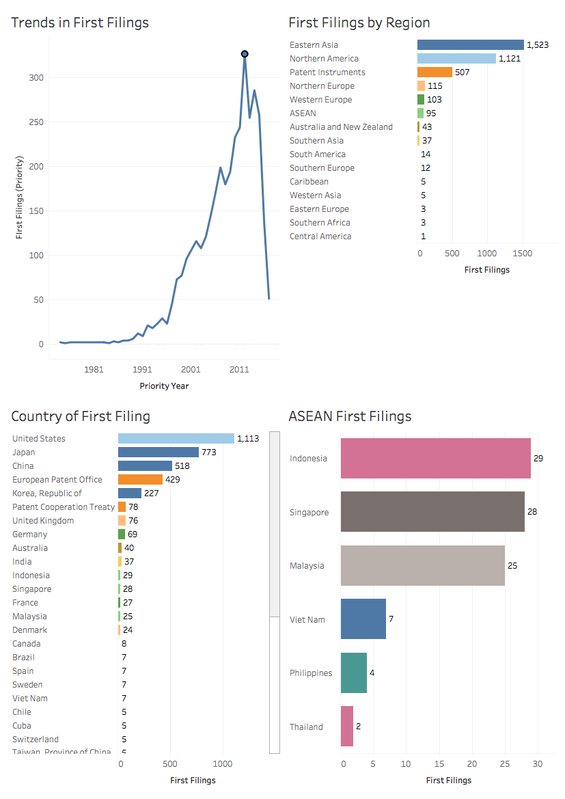
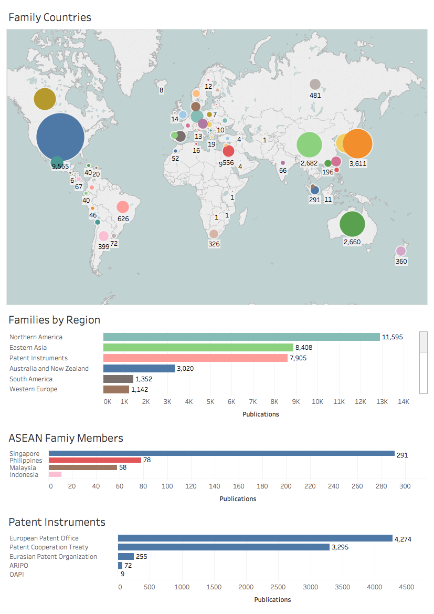
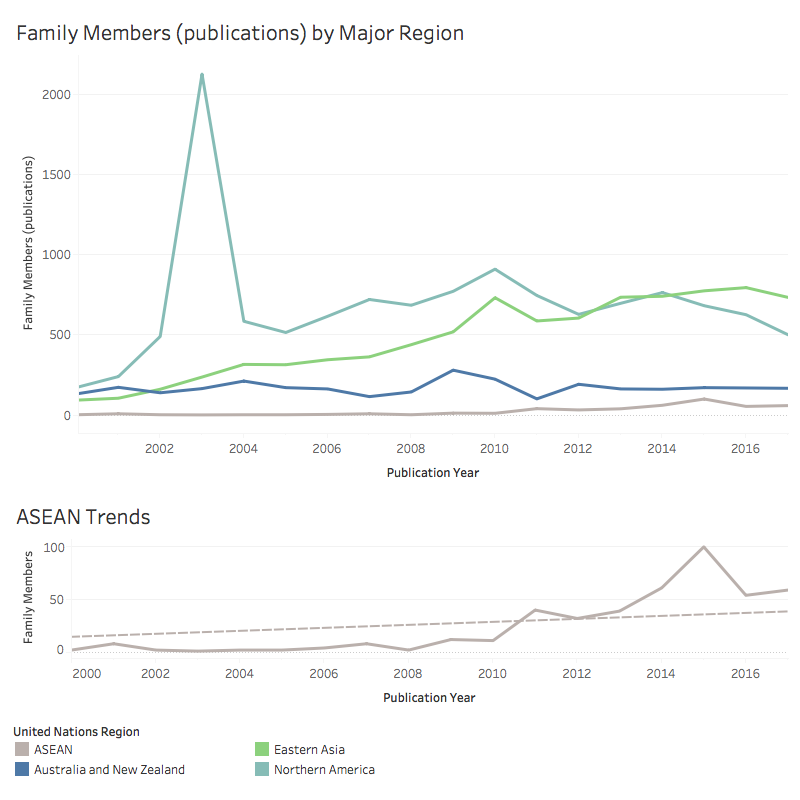
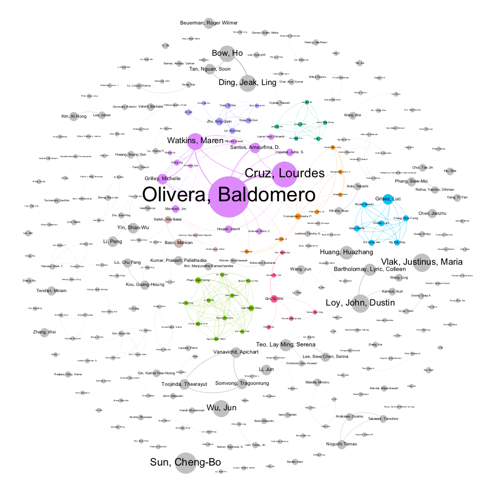

# Patent Activity for Marine Genetic Resources in the ASEAN Region {#patent}

In this section we focus on patent activity involving researchers and marine genetic resources in the ASEAN region. Our aim is to understand the nature of patent activity exhibited by researchers from within the region working on marine genetic resources and to situate their research in the wider context of research and development for marine genetic resources. 

We begin the section with a brief overview of patent activity in the region and consideration of the challenges involved in examining patent activity in ASEAN countries. We then move into analysis of patent activity from of referencing ASEAN countries that includes a marine species. 

### Patent Overview

There are two primary sources for global patent data for statistical purposes. The first of these is the European Patent Office World Patent Statistical Database (known as PATSTAT) and the second are commercial databases, such as Derwent Innovation from Clarivate Analytics. For statistical research PATSAT is preferred as the international baseline. However, our research exposed significant problems with the use of PATSTAT in the case of ASEAN countries. 

We initiated research with PATSTAT (Autumn 2016 edition) by identifying:

a) patent applications where an ASEAN country was the application authority (210,972 records). This data captures priority filings from the ASEAN region even where they are not published or published outside the region.
b) patent applications where an ASEAN country is the publication authority (173,461 records). 
c) patent applications anywhere in the world where an applicant or inventor is listed from an ASEAN country (109,744 records). 

These documents may contain duplicates and were deduplicated to 299,830 applications. This data is presented in the left panel of *Figure 4.1*.

It is immediately clear from *Figure 4.1* that the data is irregular across countries. For Indonesia, PATSTAT data is limited to information from the late 1990s and early 2000s. The Philippines displays a pattern of an early peak in the 1990s followed by a long trough until the late 2000s while information for Thailand and Vietnam is very limited and is absent for Brunei, Cambodia and Laos. At first sight the data for Malaysia and Singapore appears to be more consistent however, the presence of major peaks or troughs is typically a sign of missing or incomplete data. 

```{r echo=FALSE, fig.align='center'}
knitr::include_graphics("images/patstat_and_clarivate.png")
```

To test levels of data completeness, the same query was performed using Derwent Innovation from Clarivate Analytics (formerly Thomson Innovation). Clarivate Analytics includes the full text collections for the majority of ASEAN countries (Malaysia, Singapore, Vietnam, Thailand and the Philippines). Datasets were downloaded and deduplicated to 461,380 distinct patent applications. Trends based on Derwent Innovation data are displayed in the right hand panel of *Figure 4.1*. This approach yielded an additional 162,000 applications and had a dramatic impact on the availability of data from ASEAN countries. Data for Singapore radically improves for recent years with improvements in data for Thailand on a more modest level. Data for Vietnam, again for recent years, also improves markedly. 

Comparison of the data between PATSTAT and Derwent Innovation exposes two problems. The first of these in the case of PATSTAT is the problem of data availability. Put simply, the ASEAN collections are effectively not present in PATSTAT data (Autumn 2016). The second is the problem of data completeness. While Derwent Innovation radically improves coverage, the presence of peaks and troughs also suggests a lack of data completeness. Presumably, this reflects the lack of availability of patent documents in electronic form for earlier years. It is also likely that for later years there are lag times in the availability of electronic records. 

The practical consequence of these issues is that data for ASEAN countries is presently incomplete. We are therefore obliged to work within the constraints of the available data. 

### Search Strategy

The aim of our search strategy was to capture two areas of patent activity:

1. Patent activity for marine genetic resources originating from within the region
2. Patent activity for marine genetic resources that could involve marine genetic resources collected from the region. 

This aim required us to examine activity from within the region and wider activity. To achieve this we used a three part methodology.

a) Text mining the titles, abstracts and claims of Clarivate records from the ASEAN collection for binomial species names from the World Register of Marine Species (WoRMS) in VantagePoint. This identified  an initial 730 first filings for 302 marine species.

b) Combining the data with existing data on marine patent activity within the ABSPAT index linked to ASEAN countries. The ABSPAT index consists of 6.5 million sentences from patent documents that contain a country name and a separate table containing 21.4 million sentences containing a species names. The ASEAN country names were identified in the country table and then cross referenced with the species table yielding 15,376 documents containing a species name and an ASEAN country name. This data was deduplicated to 6,521 first filings. Text mining of this set for marine species names revealed 2,033 first filings containing an ASEAN country name and a marine species. 

c) A keyword based search strategy. We aimed to capture additional records outside the Clarivate search of ASEAN jurisdictions and the historic ABSPAT data for the US, EP and WO. As the WoRMS data consists of over 390,000 marine species names a search strategy was required that would capture those names. This strategy was advanced by developing a query that captured species names without directly using a species name. Experimentation with the texts of the 6,521 first filings for the ASEAN region mentioned above revealed that the following search strategy captured 98% of documents in the dataset. 

```{r eval=FALSE,}
"species" OR "genus" OR "family" OR "order" OR "phylum" OR "class" OR "kingdom" OR "tribe" OR "DNA" OR "nucleic" OR "nucleotide" OR "amino" OR "polypeptide" OR "sequence" OR "SEQ ID" OR "protein" OR "proteins" OR "peptides" OR "peptide" OR "enzyme" OR "enzymes" OR "plant" OR "plants" OR "animal" OR "animals" OR "mammal" OR "mammals" OR "mammalian" OR "bacteria" OR "protozoa" OR "virus" OR "viruses" OR "fungi" OR "animalia" OR "archaea" OR "chromista" OR "chromist" OR "chromists" OR "protista" OR "protist" OR "protists" OR "plantae" OR "eukaryotes" OR "eukaryotes" OR "eukaryote" OR "prokarya" OR "prokaryote" OR "prokaryotes" OR "microorganism" OR "microorganisms" OR "organism" OR "organisms" OR "cell" OR "cells" OR "gene" OR "genes" OR "genetic" OR "viral" OR "biological" OR "biology" OR "strain" or "strains" or "variety" or "varieties"
```

Beyond these terms the addition of new terms produced diminishing returns. If used across the full texts of the Derwent Innovation collection, the above search query produced 30 million publications. However, patent applicants typically include references to species and related terms in the Title, Abstract or Claims of documents. As our aim was to capture documents for marine species that may have originated from the region we therefore adopted a strategy of:

a) searching for ASEAN country names in the description section of the patent documents. 
b) searching the title, abstracts and claims for the species related terms

The search query was run in two sets (1990-2009 and 2010-2017) focusing on the US, EP, JP and WO and the ASEAN jurisdictions.

```{r query1, eval = FALSE}
(PY>=(1990) AND PY<=(2009)) AND DSC=("brunei" or "cambodia" or "indonesia" or "laos" or "lao" or "malaysia" or "philippines" or "myanmar" or "burma" or "singapore" or "thailand" or "vietnam") AND CTB=("species" OR "genus" OR "family" OR "order" OR "phylum" OR "class" OR "kingdom" OR "tribe" OR "DNA" OR "nucleic" OR "nucleotide" OR "amino" OR "polypeptide" OR "sequence" OR "SEQ ID" OR "protein" OR "proteins" OR "peptides" OR "peptide" OR "enzyme" OR "enzymes" OR "plant" OR "plants" OR "animal" OR "animals" OR "mammal" OR "mammals" OR "mammalian" OR "bacteria" OR "protozoa" OR "virus" OR "viruses" OR "fungi" OR "animalia" OR "archaea" OR "chromista" OR "chromist" OR "chromists" OR "protista" OR "protist" OR "protists" OR "plantae" OR "eukaryotes" OR "eukaryotes" OR "eukaryote" OR "prokarya" OR "prokaryote" OR "prokaryotes" OR "microorganism" OR "microorganisms" OR "organism" OR "organisms" OR "cell" OR "cells" OR "gene" OR "genes" OR "genetic" OR "viral" OR "biological" OR "biology" OR "strain" or "strains" or "variety" or "varieties" or "common name");
```

This dataset consisted of a raw 73,164 documents that were deduplicated to the first application numbers to 38,120 first filings. The available full texts for these documents were downloaded and text mined for marine species names using a tidy text mining approach [Robinson and Silge 2017]. <!---add citation--->

In total, this approach yielded 5,742 applications based in 3,587 first filings either originating from the ASEAN region or referencing an ASEAN country within the text and containing a marine species. These documents were text mined by document section (title, abstract, description and claims) in R using a tidy text mining approach as the basis for the analysis in this section. 

An important constraint with this data is that while the documents contain a reference both to a marine species and to an ASEAN country, the reference to the ASEAN country may occur for reasons that are not related to the origin of the marine species. For example, a country may be referenced as the source of a commercial supplier of material. As such, while it is a precondition of the data that it either originate from an ASEAN country and contain a marine species or reference an ASEAN species and a marine species, there is a fuzzy element to the outlines of this data.  

<!---### Marine Species in Patent Activity

As a starting point in considering the marine data it is important to note that the World Register of Marine Species (WoRMS) includes species from a range of environments. *Figure 4.2* summarises the records and the count of species by environment and by kingdom. 

```{r echo=FALSE, fig.width= 800, fig.align='center'}
knitr::include_graphics("images-patents/environment.png")
```
what I need to know is if the count of species is correct. The count of filings is correct. Based on a count in VP of those that are only terrestrial the total is 156. However, to understand whether 193 in Tableau is correct we need to bear in mind that some are classified in two places. I'm also unclear on the NAs as they could be scientific names that need linking to accepted name ids?

Figure 4.4 illustrates that for 91 species in 687 documents no environment data was available. In addition, 193 species were classified in the WoRMS data as terrestrial and appeared in 2,216 of the documents. However, the majority of these species are also classified as either freshwater, marine or brackish. Furthermore, a single document containing a marine species will typically contain other references to species. Rather than exclude documents, our approach is to exclude documents from the analysis where the organism is terrestrial. This normally applies to plants and in particular to fungi.--->

### An Overview of Filing Trends

*Figure 4.3* presents an overview of the first filings of patent applications involving marine genetic resources linked to the ASEAN region. Trends in first filings refer to the original filing of an application (anywhere in the world) and displays a characteristic *data cliff* the closer we move towards the present day. This reflects the lag time between the first filing of a patent application and its publications (typically 12 to 24 months after filing).

```{r echo=FALSE}

```

The panel on first filings by region aggregates the first filings displayed by country using the United Nations regional division and reveals that Eastern Asia (Japan, China and South Korea) account for the majority of first filings followed by North America (dominated by filings in the United States). Patent instruments (notably the European Patent Convention through the European Patent Office) and the Patent Cooperation Treaty rank third and will reflect an EP or PCT first filing strategy on the part of applicants.^[United Nations Statistical Division [Standard country or area codes for statistical use (M49)](https://unstats.un.org/unsd/methodology/m49/)] 

Within the ASEAN region filings are evenly spread between Indonesia, Singapore and Malaysia, with a lower level of first filings from Vietnam, the Philippines and Thailand.  As we will see below, in practice activity from researchers in ASEAN countries is higher than is suggested by reduction to the earliest filings. 

### Patent Family Trends

The first filings of patent applications lead to follow on application and grants (family members) within the country of filing and, using international instruments, in other countries. Patent Family analysis allows us to identify the markets where applicants are seeking protection. *Figure 4.4*
displays follow on filings around the world by individual country and summarises the data by major United Nations region. The data on family members has been adjusted to remove search reports from the data for the European Patent Office and the Patent Cooperation Treaty to avoid counting purely administrative documents. 

```{r echo=FALSE}

```

*Figure 4.4* demonstrates that demand for patent rights is highest within North America followed by Eastern Asia (China, South Korea and Japan) with regional and international patent instruments playing an important role in enabling the pursuit of protection in multiple markets. The ASEAN region itself is not a major focus of demand for patent rights. 

*Figure 4.5* displays the available data on trends in demand for patent rights, broken down by the main regions for ease of visibility. In *Figure 4.5* a major spike is immediately visible for North America that starts at the end of 2001 and peaks in 2003. This is an artefact from the transition in the United States from the publication of patent grants prior to 2001 to the publication of both applications and grants after 2001 leading to an apparent, rather than real, surge in activity. 

```{r echo=FALSE}

```

We can also observe that activity for the ASEAN region in the lower panel of *Figure 4.5* is at a significantly lower level, across the period 2000-2017 and peaking with 100 records in 2015. As this suggests, demand for patent rights involving marine genetic resources that can be linked to the region is emergent.

### Top Species

A single patent document may contain a range of species. *Figure 4.6* presents an overview of the top species by counts of applications and species counts. 

```{r echo=FALSE}
knitr::include_graphics("images-patents/patent_species_dashboard.png")
```

In total 3,114 species from the World Register of Marine Species appeared in the patent documents. We have excluded species where they were classified as terrestrial, or where environment information was not available. We have also excluded Fungi from the display of species as they are not normally sourced from a marine environment (see below). 

<!--- the issue is that terrestrial only species co-occur with marine species in 1184 documents. So those documents can't simply be excluded--->

*Figure 4.6* illustrates that some of the top species in the overall marine data are plants. This also illustrates some of the challenges involved in identifying marine species that cross environments. *Apium graveolens* is better known as Celery and is included within the marine data because it was originally a marsh plant that can grow in salt water conditions and features in patent activity for herbicide resistance (JP2013046624A). *Phleum pratense* is a widespread invasive grass that can be found in brackish conditions and appears in patent activity for control of plant pathogens (IN200800137P1). *Phragmites australis* is a perennial wetland grass with patent claims that focus on the use of the species, among others, as feedstock in methods for producing cellulose pulp (WO2017178849A1). *Ammophila arenaria* is commonly known as beach grass and typically appears as a passing reference in the description of patent activity focusing on genetic engineering to increase yields in a wide range of plants, rather than as the focus of an invention (EP2316956A2). 

As noted in the discussion of the scientific landscape, fungi such as *Fusarium oxysporum*, *Aureobasidium pullans*, *Fusarium solani*, *Aspergillus terreus* and *Alternaria alternata* among other fungi in the data are extremely widespread in soils and other habitats and patent activity is not typically directly linked with these organisms from a marine environment. We have therefore excluded fungi from the display of species in *Figure 4.6* while noting that marine fungi are an increasing focus of interest in the wider scientific literature [@Kim_2012]

*Figure 4.7* presents the data above in terms of the technology areas that are the focus of activity by the number of species and the number of applications. The definition of technology areas is based on the IPC Subclass. The Subclasses have been edited to short versions for ease of presentation. 

```{r echo=FALSE}
knitr::include_graphics("images-patents/technology_areas_species.png")
```

<!--- numbers checked and correct--->
<!--- sankey diagram here--->

*Figure 4.7* reveals that species and applications across the dataset are concentrated in the fields of biotechnology and pharmaceuticals. However, as we will see in more detail below fields such as aquaculture area also prevalent but are dispersed across the fields of Animal Husbandry (A01K), Animal Foods (A23K) and Water/Waste Water/Sewage Treatment (C02F). 

<!---### Marine Species in Titles, Abstracts and Claims. Attempting to filter on derwent format and applicants leads to an error to see if I can do that but of course it is in the cloud) In practice, the presence of widespread species that exist both in a terrestrial and a marine environment suggests that we can narrow the focus on two ways. First, we can focus on those species that appear in the Title, Abstracts or Claims of a claimed invention. Second, given their widespread nature we exclude fungi from the analysis except where a demonstrable marine origin can be identified.---> 

### ASEAN Researchers as Inventors 

In the previous section we examined the research activities of the approximately 17,625 researchers involved in research on marine species linked to the ASEAN region. We now focus in on the analysis of those researchers within the scientific literature who are also inventors. 

In order to identify researchers who are also inventors we mapped the names of the 17,625 researchers together with the inventor field containing 9,382 cleaned names. Name matches and close name matches were then examined against the criteria of the appearance of co-authors who are also inventors, applicant name matches and matches on species names. Where one or more of the same or very similar names matched with either a co-author as inventor, the organisation or the species name they were assumed to be what we call an author inventor. 

In total we identified 290 authors who are also inventors in patent applications involving marine genetic resources who together accounted for 369 applications that referenced 446 marine species. 

*Figure 4.8* displays the rankings for species appearing in patent documents based on counts of applications. The smaller panels display details for certain kingdoms that would otherwise be hidden. 

```{r echo=FALSE}
knitr::include_graphics("images-patents/author_inventor_species_dashboard.png")
```
<!---asparagus oficinalis excluded as a terrestrial and common plant--->

In considering *Figure 4.8* we can readily see that animal species are dominant with shrimp genera (Penaeus) in the aquaculture sector dominating the rankings with *Paralichthys olivaceus* or Japanese halibut also appearing high in these rankings. Bacteria in the Vibrio genus, again reflecting the aquaculture sector, dominate the rankings for bacteria with *Bacillus thermus*, a high temperature and alkaline tolerant bacterium, among others such as *Geobacillus kaustophilus* (a deep sea bacterium originally isolated from the Mariana Trench)^[https://microbewiki.kenyon.edu/index.php/Geobacillus_kaustophilus] and *Photobacterium damsela* (associated with Pastereullosis in fish) appearing in a list of 35 bacteria in the patent documents. 

In the case of plants, they typically appear in the description section of patent documents within the dataset rather than as the focus of the invention. *Sporobolus virginicus* is a shoreline couch grass, *Bruguiera gymnorhiza* is the black mangrove, *Hippomane mancinella* is a coastal tree that is often found in association with mangroves (WO2013137822A1), *Kandelia candel* is a mangrove native to South East Asia and *Manilkara zapota* is a widely grown coastal fruit tree. *Phleum pratense* is a widely distributed coastal grass, and *Rumex crispus*, or yellow dock, is a widespread plant with a coastal sub species. 

*Figure 4.9* displays a summary for researchers as inventors based on counts of the number of patent applications associated with a researcher. 

```{r echo=FALSE}
knitr::include_graphics("images-patents/author_inventor_dashboard.png")
```

We can clearly see in *Figure 4.9* that while overall applications are low, there are clear leaders and that organisations represent a mixture of universities, government research organisations and private companies across a number of countries including the United States, China and Japan. 

In the analysis of the scientific literature we approached the data in terms of networks of authors and organisations. We will adopt the same approach for the analysis of the patent data. Note that collaboration networks in patent data, notably between organisations, are typically sparser than in the case of the scientific literature. 

*Figure 4.10* displays the network clusters for author inventors where node size is based on the number of applications associated with a researcher. *Figure 4.11* displays the network of organisations (applicants) associated with the applications. 

```{r echo=FALSE}

```

```{r echo=FALSE}
knitr::include_graphics("images-patents/author_inventor_applicants_network.png")
```

*Figure 4.9* reveals clear clusters of researchers who also appear as inventors on patent applications involving marine species. As we will see below, in practice the data for researchers reveals three basic sets of circumstances where researchers submit patent applications. 

a) Cases where a researcher has a pre-existing patent portfolio (that may be in a different subject area such as plant biotechnology) and join a research collaboration in the new area;
b) Cases where researchers jointly submit patent applications arising from their joint research;
c) Cases where members of a research group go on to form a sub-cluster and file patent applications arising from their research;

In the case of data on applicants <!-- note that the network presently includes the research on fungi and a small number of false positives that need to be removed---> the data we can see that as expected, applicants are typically sole applicants. However, we can see cases of collaboration in patent filings around the National University of Singapore, the University of Utah and the University of Tokyo. In other cases such as Guangdong Ocean University in China, a significant number of filings are observed as a sole applicant. 

For ease of exploration of the patent data we will approach the analysis using the clusters of researchers as inventors starting with the larger clusters and then exploring the patent data based on citation and areas of research. In approaching the data note that in some cases patent activity involves a researcher outside the region who has collaborated with a researcher within the ASEAN region. 

The most prominent and top cited cluster in the inventor network is represented by [Baldomera Olivera](https://en.wikipedia.org/wiki/Baldomero_Olivera) who is a graduate of the University of the Philippines and Distinguished Professor of Biology at the University of Utah. He pioneered research on cone snail toxins (conotoxins)^[https://www.ncbi.nlm.nih.gov/pubmed?term=Olivera%20BM]. His work on cone snails appeared on the front cover of Science magazine in 1990.^[[Science magazine](http://science.sciencemag.org/content/249/4966)]. Research on *Conus magus* by his team led to the development of the severe pain analgesic for Ziconotide (SNX-111; Prialt) that was approved for use by the US Food and Drug Administration in 2004 under the trade name Prialt and subsequently by the European Commission in 2005.^[[Wikipedia entry for Ziconotide](https://en.wikipedia.org/wiki/Ziconotide)]. Professor Olivera's research proved to be a major spur to research on cone snails and members of the cluster, notably Lourdes Cruz (below) have gone on to further research in this area.

2. The second major cluster is represented by [Cheng-Bo Sun](https://www.researchgate.net/scientific-contributions/2040070693_Cheng-Bo_Sun) at Guangdong Ocean University in China who has conducted research on the *Penaeus mondon* immune system. The research has been conducted in collaboration with JA Benzie who lists collaborations with the University of Cork in Ireland and WorldFish in Penang, Malaysia. Cheng Bo Sun submitted two sets of filings in 2015. The first set, filed on the 9th of June 2015, consists of 8 applications and includes methods for cultivating parent fish in waste water from prawn cultivation (CN104839079A), a mass scale outdoor cultivation method and facility (CN104839070A), a low soil prawn pond (CN104938381B). A specific focus of these filings is the cultivation of *Sillago sihama* (northern whiting fish). The second set (filed on the 12th of December 2015 focuses on a method for controlling white spot syndrome by polyculture of sea bass and *Marsupenaeus japonicus* (CN105494189A), a method for controlling bacterial diseases in blue fish and Japanese prawn breeding (CN105409848A), a method for cultivating mixed *Epinephelus oanceolutus* (Giant grouper) and *Marsupenaeus japonicas*(Kuruma prawn) to control white spot syndrome (CN105309360A) and a method for controlling prawn liver pancreas gland necrosis disease by mix breeding of desmodium and Japanese capsule prawn (CN105532522A).

3. The third major cluster (consisting of 10 applications ) is Dustin John Loy associated with Harris Vaccines, and associated with researchers at the University of Iowa, who has published research on therapeutic antiviral treatments against myonecrosis virus in *Litopenaeus vannamei* based on the spread of the virus from Brazil to Indonesia [@Loy_2012; @Loy_2013]. A set of filings in 2011 and 2012 in Brazil, China, the European Patent Office and the United States include PCT filings focus on methods for rapidly producing vaccines for protecting an animal (in general) from a pathogenic micro-organism (VN45743A, US2013122025A1, US2013064839A1, US2012107355A1, WO2013066665A1,  WO2012058072A1, US2012108649A1, US20130045223A1, WO2012058073A2, WO2013103434A1). 

4. [Justinus M Vlak (known as Just Vlak)](https://www.wur.nl/en/Persons/prof.dr.-JM-Just-Vlak.htm) is at the University of Wageningen and has collaborated with NX Tuyen, who is affiliated with the University of Wageningen and the Institute for Aquaculture Research in Ho Chi Minh City, Vietnam [see @Tuyen_2014]. Justinus Vlak had previously filed for patents in 1999 and 2000 including for Proteins derived from White Spot Syndrome Virus (WO2001009340A1), antigenic proteins of shrimp white spot virus (WO2002022664A2), and a White Spot Syndrome Virus Vaccine (WO2003000900A1) with Akzo Nobel NV and Intervet Iinternational BV. 

5. Husband and wife research team Professors Hu Bow and Ding Jeak Ling at the National University of Singapore (NUS) received the 2012 Outstanding NUS Innovator Award for what was described as the one of the NUS's most successful commercialised technologies.^[[Factor C: Saving Humans and Horseshoe Crabs](http://enterprise.nus.edu.sg/success-stories/detail/12)] The focus of the technology is a cloned Horseshoe Crab *Carcinoscropius rotundicauda* recombinant cDNA Factor C (rFC) that can be used to remove endotoxins from a sample and subsequently for use in endotoxin assays (WO1999015676A1, US6645724B1, US5716834A). Filings have also been made for recombinant polypeptides for endotoxin biosensors and removal (US2004175388A1) and treatment of bacterial infections (US2008085865A1). The University reports that the recombinant Factor C was licensed to Lonza. Work on Sushi peptide technology was licensed to BioDTech.

<!---Jun Wu from xxx is a single inventor whose has filed for patents focusing on an East China Sea sea cucumber THIS MAY BE A FALSE POSITIVE ON THE NAME AS THE RESEARCH WAS ON Xylocarpus moluccensis NINGBO HI-TECH ZONE KEBO HUIKE TECHNOLOG
UNIV THREE GORGES
UNIV XIAN INT
when the author is Chinese National academy of sciences
Huang, Huazhang is Fusarium solani and so is not relevant--->


6. [Dr. Serena Teo](http://sjinml.nus.edu.sg/profile-serena-teo/) is a researcher at the St. John's Island National Marine Laboratory of the National University of Singapore. Her research has focused on barnacles (*Balanus amphitrite*) associated with surface fouling or biofouling [@Phang_2009; @Guo_2011; @Petrone_2013]. Patent filings focus on an organic antifouling compound that is an alternative to existing technologies involving copper. The application  claims that the invention provides "cheap, easy to prepare additives that do not contain metals and therefore have reduced toxicity in marine environment"(SG166436A1, EP2294144B1, WO2009139729A1). A second filing focuses on functionalised anti-fouling compounds as environmentally benign anti-fouling compounds that can be applied in seawater conditions including cooling towers and desalination plants (SG183158B, US2012301423A1). A third document focuses on biocidal and/or biostatic treatments for biofilms and biofouling (US2006110456A1). Marine biofouling is a major cost associated with marine transport and infrastructure [@Callow_2011]. Dr. Teo's work is an example of an effort to promote green technology to address the environmental impacts of metal and other toxic biofouling treatments in aquaculture and wider maritime applications [@Callow_2011;@Floerl_2016] 

7. [Luc Grisez](https://nl.linkedin.com/in/luc-grisez-981a455) has conducted research on Scale Drop Virus in the Asian seabass *Lates calcarifer* that began to affect aquaculture in South East Asia from 1992 onwards. The research involved near complete genome sequencing to identify the source virus (a Megalocytivirus genus of the Iridoviridae family) and the development of a vaccine [@de_Groof_2015]. Patent activity, which pre-dates this published research, includes an immune stimulant for use in a vaccine against the causative viruses for Big Belly Syndrome in fish (WO2008074783A1, CN1904034B) and a vaccine against Rickettsia-like organisms (WO2007138036A1). The recent publication on Scale Drop Disease was immediately preceded by patent filings on the isolated virus and derivatives (WO2014191445A1, VN46347A).

<!---Not so sure on Li Jun as a false positive
Drop Li Peng as Fusarium --->

8. Michelle Grilley at Utah State University has worked in collaboration with colleagues at the University of the Philippines on conus peptides (and forms part of the wider group above) demonstrated that the contryphan family of peptides is widely distributed in venoms of the fish-hunting cone snails. [@JACOBSEN_2009, originally published 1998]. Patent filings focused on the  contryphan peptides (US6153738A, WO1999033865A1) with later filings focusing on kappaA conopeptides for use in combating multiple sclerosis and similar disorders 	(WO2000020018A1, US2003181368A1, US2006014673A1). 

9. Professor Tragoonrung Somvong at Kasetsart Univ is a plant genomics specialist who was a member of the International Rice Genome Sequencing Project for Thailand and presently director of [BIOTEC in Thailand](http://www.biotec.or.th/en/index.php/about-us/management-team). His research has included collaboration in identifying microsatellite markers in *Penaeus mondon* [@Wuthisuthimethavee_2003]. Professor Somvong's patent activity reflects his focus on plant biotechnology in the form of filings on transgenic plants with increased grain aroma to enhance flavour (JP2011004752A, IN200600050I1, US2006168679A1, US2009170202A1, EP1683869A2)  

10. Shao-wu Yin has worked with colleagues at Hainan University and Nanjing Normal University in China on the isolation of microsatellite marker loci in the marble goby fish *Oxyeleotris marmoratus*.  *Oxyeleotris marmoratus* is found in freshwater and brackish waters in the Mekong River and all ASEAN countries plus China.^[Allen, D.J. 2011. Oxyeleotris marmorata. The IUCN Red List of Threatened Species 2011: e.T181009A7657958. http://dx.doi.org/10.2305/IUCN.UK.2011-1.RLTS.T181009A7657958.en] The species is commercially important both in terms of fisheries, aquaculture and the aquarium trade. Patent activity by this team from China focuses on microsatellite markers to identify *Oxyeleotris marmoratus* and *Odontobutis potamophila* fry in aquaculture (CN102653795A and CN102134586A), and a fish hybridization breeding method for river sand bostrichthys and oxyeleotris (CN103651219A).

11. [Professor Mahiran Basri](https://www.researchgate.net/profile/Mahiran_Basri) at the Department of Chemistry at the Universiti Putra Malaysia (UPM) has mainly focused on enzymes. Her research with colleagues at UPM and Tokai University in Japan involving marine species focused on the nutraceutical potential of the commercially important edible jellyfish species *Acromitus hardenbergi*, *Rhopilema hispidum* and *Rhopilema esculentum* [@Khong_2016]. Other research has focused on a novel *Geobacillus zalihae* thermophylic lipolytic bacterium that was isolated from the effluent of a palm oil mill in Malaysia [@Rahman_2007]. The research highlights that Geobacillus species are found in hydrothermal vents, oilfields, soils and compost from hay. Their research focused on the identification of the new strain Geobacillus zalihae sp. nov. TIT (= DSM 18318(T); NBRC 101842(T)) [@Khong_2016]. Patent activity arising from this research includes a Lipase from a biologically pure Geobacillus strain for use in food processing to flavour dairy products, as a digestive in medical use or to improve fats and oils (US2006024789A1, JP2006042820A) and a separate application for lipase gene from a biologically pure culture of *Bacillus sphaericus* strain 205 isolated from soil (US20050260737A1). A European patent grant is also part of the portfolio for a novel thermostable lipase from Geobacillus sp. strain ARM and A. thermoaerophilus strain AFNA for use in the food industry, surfactants, processing oil, detergents, pesticides, and the leather industry (EP2450458B1). 

<!----12. [Ki Hong Kim was](https://www.researchgate.net/scientific-contributions/2080891753_Ki_Hong_Kim) was affiliated with Pukyong National University in Busan in South Kirea where. Cannot clearly locate--- patents appear relevant but at a different university --->

12. [Guang-Hsiung Kou](https://www.researchgate.net/scientific-contributions/39872049_Guang-Hsiung_Kou) while at the Institute of Zoology at the National Taiwan University in collaboration with researchers at the National University of Singapore and Tokyo University of Marine Science and Technology conducted research on the comparative genetics of *Panaeus mondon* infected with White Spot Syndrome Virus. The research focused on identifying differences in gene expression in infected and non-infected shrimps using DNA sequencing to create Expressed Sequence Tag libraries [@Leu_2007]. Later research was also performed on White Spot Syndrome Virus (WSSV) in shrimp broodstock in collaboration with colleagues from other universities in Taiwan and Jie-Cheng Chuang at the Uni President Vietnam Co company [@Chang_2012]. Guang-Hsiung Kou's patent activity in this area dates to the late 1990s and includes DNA primers and probes to screen for the virus WSBV (baculovirus associated with white spot syndrome) in shrimps (US5824535A, EP785255A2, US6190862B1 originally filed in 1996) and a later 2005 filing on promoter sequences for WSSV early genes and their use in recombinant DNA techniques (US7429480B2).

13. [Prakash Kumar Pallathadka](https://en.wikipedia.org/wiki/Prakash_Kumar_Pallathadka) is a Professor of Biological Sciences at the National University of Singapore with research focusing on plant sciences. His research has focused on proteomics in connection with the mangrove tree *Avicennia officinalis* to understand salt tolerance in mangroves. This has led to the identification of Expressed Sequence Tags (ESTs) linked to salt stress tolerance and additional work on the role of root hydrophobic barriers in salt exclusion [@Krishnamurthy_2014; @Jyothi_Prakash_2014; @KRISHNAMURTHY_2014a]. Patent activity is not directly linked to this research but includes filings from 2007 on a putative cytokinin receptor for modulating the expression of traits in plants (EP2124522B1). In a separate area of research  a family of filings is observed on a novel snake toxin (originally filed in 2004 and published as US2009285825A1, SG132985A1 and WO2006068625A1).

14. [Lo Chu Fang](https://researchoutput.ncku.edu.tw/en/persons/chu-fang-lo) is affiliated with the Institute of Zoology, National Taiwan University and the Institute of Bioinformatics and Biosignal Transduction at National Cheng Kung University in Taiwan. She is presently a Professor in the Department of Biotechnology and Bioindustry Sciences at the National Cheng Kung University. A series of research articles have focused on viral infection in *Penaeus mondon* and related commercially important species with a notable focus on proteomics [@Suraprasit_2014; @Rattanarojpong_2007; @Gonnet_2008]. Patent activity includes a 1996 filing for the identification and detection of WSBV virus (US5824535A, US6190862B1) a 2005 filing for Promoter sequences for WSSV early genes (US7429480B2) and a 2006 filings for a highly expressed WSSV peptide (US20070269453A1).

15. [Siew-Moi Phang](https://umexpert.um.edu.my/phang) is the Director of the Institute of Ocean and Earth Sciences at the University of Malaya and her research focuses on algal biotechnology. Her research includes work on the Kappaphycus Doty and Eucheuma J. Agardh genera of algae as sources of commercially important carrageenan in Malaysia [@Tan_2012]. Patent activity has involved a 2010 filing (MY2010PI5261A) introducing a vector into algae that express modified V28 peptides that when ingested elicit an immune response to WSSV virus among shrimps in the Penaeida family (WO2012064181A1, US9475844B2) and a related filing for a vaccine against White Spot Syndrome that can be added to shrimp feed (US20140170181A1, WO2012064180A1).

16. [Raymond S Norton](https://research.monash.edu/en/persons/raymond-norton) is Professor of Medicinal Chemistry at Monash University in Australia and has conducted research in collaboration with [Nonlawat Boonyalai](https://www.researchgate.net/profile/Nonlawat_Boonyalai) at Kasetsart University in Thailand along with colleagues from China and elsewhere in Australia focusing on the cone snail *Conus imperialis* [@Ye_2012]. Earlier research by Norton focusing on the sea anemone *Stichodactyla helianthus* led to a filing in 1996 on ShK toxin compositions from the sea anemone (US6077680A, WO1998023639A2). The granted patent US6077680A has attracted 87 citations.

17. [Ocky Karna Radjasa](https://scholar.google.co.uk/citations?user=oRy3ajUAAAAJ&hl=en) at Diponegoro University in Indonesia has been active in research on the chemical properties of marine invertebrates, notably corals and their bacterial symbionts, and extending to recent work on the role of bacteria in diseases in seaweeds [@Ayuningrum_2017; @Trianto_2017; @Syafitri_2017]. Patent activity arising from this research includes a 2013 filing in Indonesia involving a *Virgibacillus salarius* strain for producing d-carotene as an alternative bio-pigment health product (ID201403020A). An earlier filing in 1996 focused on a wood preserving composition derived from the soft coral Sinularia sp. that would inhibit biofilm forming and wood boring organisms (WO1997034747A1).

18. Ratih Pangestut at the Indonesian Institute of Science and Se-Kwon Kim at Pukyong National University in South Korea have conducted research on the highly valued and widely traded sea horse *Hippocampus trimaculatus* [@Pangestuti_2015]. The scale of the trade in the sea horse in dried form for traditional medicines and in live form for the aquarium trade, along with the impact of shrimp and trawl fisheries on habitats and capture as bycatch is such that the IUCN Red List categorises the species as vulnerable ^[Wiswedel, S. 2015. Hippocampus trimaculatus. The IUCN Red List of Threatened Species 2015: e.T10087A17252219. http://dx.doi.org/10.2305/IUCN.UK.2015-2.RLTS.T10087A17252219.en. Downloaded on 24 March 2018.]. Research by Pangestus and Kim has focused on the isolation of bioactive peptides targeting Alzheimers disease [@Pangestuti_2015]. This is reflected in a 2012 patent filing focuses on a composition containing a bioactive peptide for preventing or treating neurodegenerative disorders (KR2014042148A, US20140094414A1). 

19. [Yannick	Gueguen](http://orcid.org/0000-0002-8749-9582) is a researcher at IFREMER in France who has conducted extensive research on marine organisms in the ASEAN and Pacific region. Research in collaboration with [Anchalee Tassanakajon](http://www.bc.sc.chula.ac.th/11Anchalee.html) at Chulalongkorn University has focused on a recombinant expression and anti-lipopolysaccharide factor (ALF) from the black tiger shrimp Penaeus monodon [@SOMBOONWIWAT_2005]. Earlier research by Yannick Gueguen on the genome sequence of *Pyrococcus abyssi* led to a 1999 filing on genome sequences involved in replication with potential industrial use (FR19995034A, WO2000FR1065A, EP1196583A2).  

20. Chau Van Minh and Phan Van Kiem from Vietnam have conducted extensive research on the bioactive properties of a range of marine organisms including sea urchins, marine sponges, corals and starfish [@Thao_2015; @Thao_2015a; @Kiem_2017; @Ngoc_2017; @Vien_2016]. The available patent data suggests that patent filings have not been a substantive focus of attention, although this may be affected by the availability of information from the national collection in English. However, Chau Van Minh is listed as an inventor on a 2015 filing in Vietnam for an antimicrobial compound from the marine actinobacteria Nocardiopsis sp.G057 (VN10017267B). Phan Van Kiem is listed in a separate filing in Vietnam from 2011 for a pyrrole oligoglycoside compound extracted from the starfish *Asterina batheri* collected from Vietnam's seas that has strong anti-inflammatory activity.    

### Conclusion

In this section we have focused on providing an overview of patent activity involving marine genetic resources in the ASEAN region. As we have seen patent activity can be described as emergent. We have concentrated our analysis on the emerging clusters of researchers from within the region, or with links to the region, who have been involved in filing patent applications. Two significant success stories, from the Philippines in the case of research leading to the drug Ziconitide from cone snails, and from Singapore in the case of recombinant Factor C from the Horseshoe Crab were identified. Looking beyond these examples of successful commercialisation of research we have observed patent activity in relation to aquaculture, nutraceuticals, industrial biotechnology, pharmaceuticals and vaccines, and marine biofouling. It remains unclear whether these other emerging areas of patent filings have led to successful commercial products and processes. However, the researchers who have pursued patent protection also represent a pool of people who have developed experience with the patent system as they seek to commercialise their work. That pool is presently small but encompasses researchers from Indonesia, Malaysia, the Philippines, Singapore, Thailand, Vietnam and other countries, including the United States and China, who could serve as a resource for consultation on appropriate strategies for research groups interested in the practical and commercial dissemination of the results of their work in the ASEAN region. 
